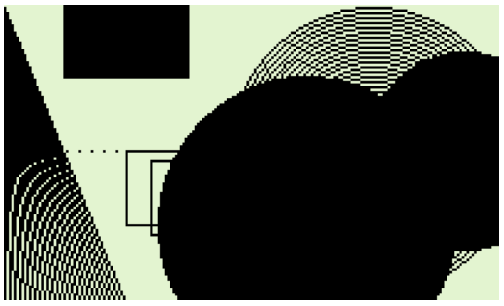

# PyRPN - Python to RPN converter

Python to RPN converter for generating programs for the HP42S and DM42 calculators (and emulators like Free42)


Converter is available at [http://pyrpn.atug.com](http://pyrpn.atug.com)

## Purpose

Converts Python code to RPN for use in HP42S/DM42 calculators (and emulators like Free42). This allows for easy programming of the HP42S/DM42 using Python syntax.  

[HP 42S](https://en.wikipedia.org/wiki/HP-42S) is a programmable RPN calculator from the 1980s.  


[DM42](https://www.swissmicros.com/product/dm42) is a modern clone of the HP42S.  


[Free42](https://thomasokken.com/free42/) is a free emulator of the HP42S.


### Why convert Python to RPN?

Programming a HP calculator in RPN is a joy for those who know how - but for most of us it is like programming in assembler code.  e.g.

```
RDN
0
STO 01
1
STO 02
0
RCL 00
1
XEQ 78
STO 03
LBL 00
ISG 03
GTO 01
GTO 02
LBL 01
RCL 02
STO 04
RCL 01
RCL 02
+
...
...
etc.
```


You have to deal with GOTO statements, no while loops etc. It is not easy to write complex programs in RPN.  Python is a modern, high-level, structured programming language.  It is much easier to write complex programs in Python than in RPN.  This converter allows you to write your program in Python, then convert it to RPN for use in your HP calculator.

Here is the same program in Python:

```python
def fib(n):
  a = 0
  b = 1
  for i in range(0, n):
    old_b = b
    b = a + b
    a = old_b
  return a
```

### Why not just run Python on a laptop?

Yep. You should.

My first computational programming device was a HP calculator.  I have fond memories of it.  

This project is for those of us who have nostalgia and love for those old HP calculators.  We want to write programs for them, but we don't want to write them in RPN.  We want to write them in Python.  This project allows us to do that.

In other words, this is a fun project but of little value to anyone doing real work. 

## Running the converter

Simply visit 
[http://pyrpn.atug.com](http://pyrpn.atug.com)

## Running the converter locally using Docker

Install docker on your computer then run the following commands:

```
git clone git@bitbucket.org:abulka/python_to_rpn.git

cd python_to_rpn

docker compose up
```

Then visit [http://localhost:5001](http://localhost:5001)

You can also visit [http://localhost:8001](http://localhost:8001) to examine the redis database containing the examples.

### Stopping the converter

To stop the server, press Ctrl-C in the terminal window where you ran the docker compose command.  Or delete the container using the docker desktop app.  Or run the following command:

```
docker compose down
```

## Installing and running the converter locally

Install Python 3.8 or later on your computer.
Install the redis server on your computer then run the following commands:

```
pip install -r requirements.txt
python server.py
```

Then visit http://localhost:5001

# CLI Usage

```
python pyrpn.py cli-examples/eg1.py
```

where `cli-examples/eg1.py` is a Python file containing e.g. the following code:

```python
LBL("main")

length = 10
width = 20

report()

def report():
  print('length is', length, '[LF]width is', width)
```

which should generate the following output:

```
Generated 20 lines.
01 LBL "main"
02 10
03 STO 00
04 20
05 STO 01
06 XEQ A
07 RTN
08 LBL A
09 "length is"
10 ├" "
11 ARCL 00
12 ├" "
13 ├"[LF]width is"
14 ├" "
15 ARCL 01
16 AVIEW
17 RTN
18 LBL 50
19 "-Utility Funcs-"
20 RTN
```

# First Release Announcement


You write code in a high-level structured language (which happens to be Python 3 syntax), hit a button, and RPN is generated.


You then paste the RPN into Free42 or transfer it to your DM42 (by [creating a raw](https://www.swissmicros.com/dm42/decoder/)) - and it runs.

**Examples:**
- [Examples](http://pyrpn.atug.com/examples)

**User Guide:**
- [User Guide](http://pyrpn.atug.com/help)

**Canvas for 42S Simulator:**
- [Canvas for 42S Simulator](http://pyrpn.atug.com/canvas)

**List of HP42S Commands Supported Reference:**
- [List of HP42S Commands Supported Reference](http://pyrpn.atug.com/cmds)

The converter supports core Python syntax (which is very powerful) but does not implement the built-in Python libraries that you would get in desktop Python. You have to rely on the ability to call HP42S commands from Python to do your work - which, of course, you can do. Specifically, it has the following capabilities:

- Variables
- Functions, Multiple functions, nested functions
- Parameter passing, receiving return values, multiple return values
- if elif else
- Comparison operators == != > < >= <=
- Booleans True, False and operators not or and
- for loops, range(), for...in iteration through lists and dictionary keys
- while loops, while...else
- continue and break operations in for loops and while loops
- Lists and Dictionaries (basic operations only)
- Matrices, Pythonic matrix element access syntax [row,col]
- NumPy compatible slicing syntax for sub-matrices
- Complex numbers using either 42S or Python native syntax
- Expressions involving nested brackets
- assert
- Testing and clearing of flags
- Access most HP42S commands as function calls e.g., `FIX(2)`
- Some enhanced functions to make life easier e.g., `varmenu()` automates and simplifies the generation of MVAR based code.

Included in the [examples](http://pyrpn.atug.com/examples) are some graphic primitive routines originally written for the Raspberry Pi in C rewritten into Python and converted to RPN. This now gives the 42S a small graphics library to generate lines, circles, rectangles, filled shapes, etc. More information in [this related thread](http://www.hpmuseum.org/forum/thread-10160.html). This would be of particular interest to owners of the DM42 calculator, which has the larger screen, crying out to be taken advantage of.


and targeting the larger screen size of the DM42 - this image:



The purpose of the Python to RPN converter is not to usurp the beauty and role of handcrafted RPN; it is to provide an alternative way of programming the HP42S for those who prefer to use if statements and for loops, rather than GTO's and ISG. The purpose is also to provide powerful new features to make programming the 42S easier: lists, dictionaries, matrix access syntax, native complex number syntax, alpha messages easily built with multiple parameters in one line, simpler menu support using `aview()`, etc.

My hope is that the Python to RPN converter will contribute to keeping this wonderfully designed calculator alive, just as Free42 and the DM42 have done. I look forward to what people build, using the increased ease of use and power of a structured programming language, and hope to see some great new programs developed for the 42S - and for Free42 and DM42 in particular - where it is particularly easy to transfer generated RPN to those devices (in the case of Free42 on a Mac or PC, it's as simple as copy-paste - there is a tutorial in the [user guide](http://pyrpn.atug.com/help)).

I hope people like it.

# Architecture & Design of this App

Here are [the slides](https://docs.google.com/presentation/d/1_qNKLofUwPhs_LsF-AQM-0WstS2jeYrusU5El4RLfnc/edit?usp=sharing) of a talk I gave to a local Python User Group in Melbourne, Australia, about how I used the Python AST capabilities to build the Python to Rpn converter. 

The reception to the talk was good, and then became super fun and buoyant once the audience realised I had targeted an old HP calculator with this fancy Python technology - especially when I pulled out my real HP calcs for all to see and touch.

# Documentation

There is an extensive list of examples and tutorials, and API reference accessible via the main menu in the app.


Direct link to in-depth [documentation](https://docs.google.com/document/d/e/2PACX-1vRV7G4VAQtATvpJ7VaNlN5kjdTMHI97FVybvPjeEwHnPqttnkqa9zRMbym4h--0QAlltgadqO4fDnAX/pub).

# Author

Andy Bulka
[https://abulka.github.io/](https://abulka.github.io/)

# License

MIT License

